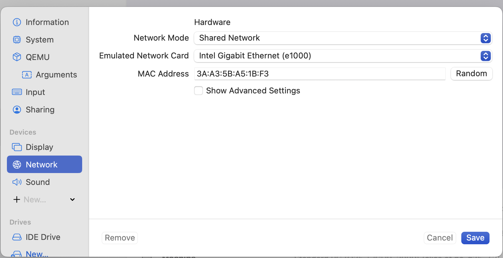
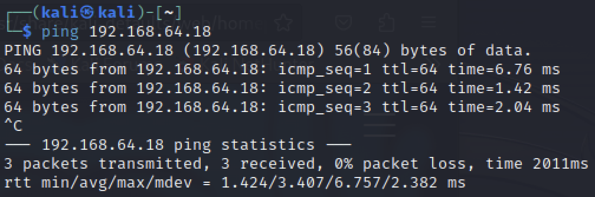
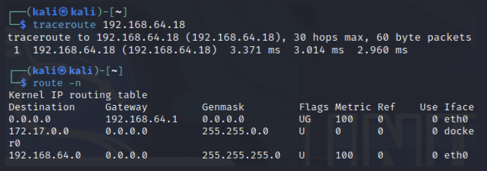
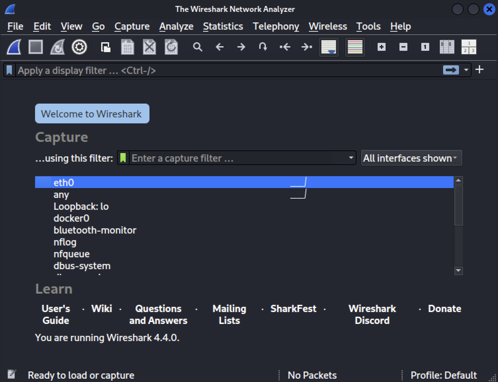
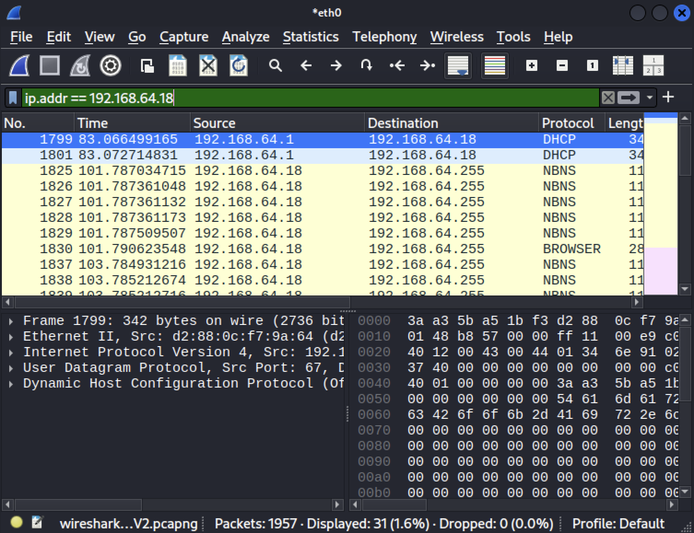
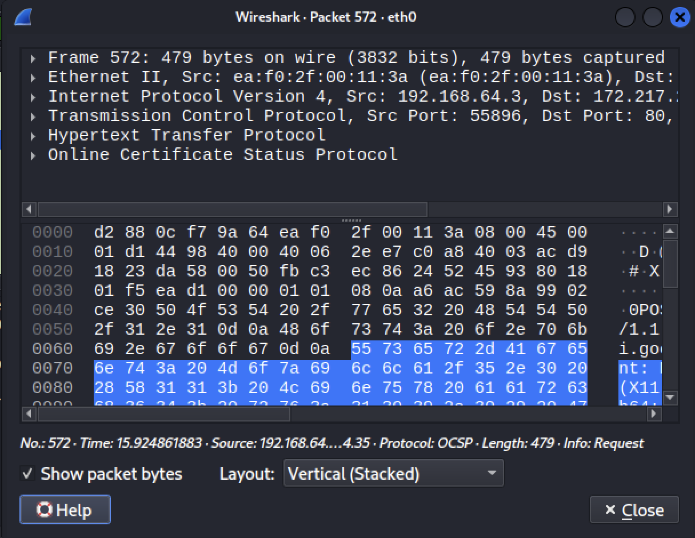
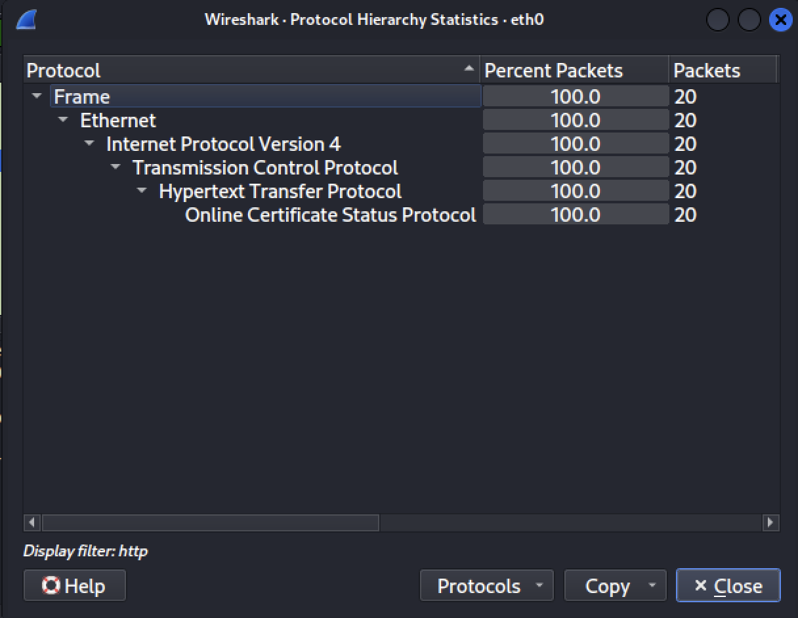
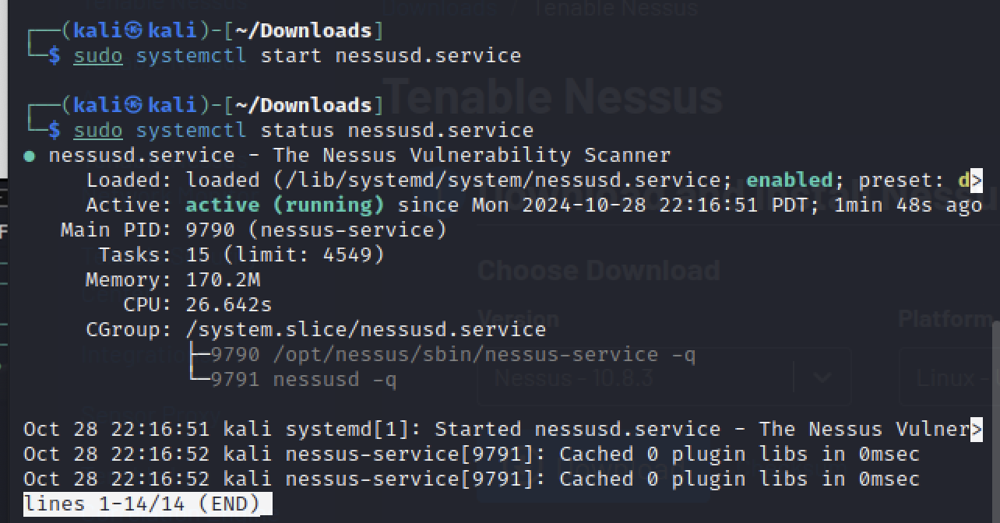
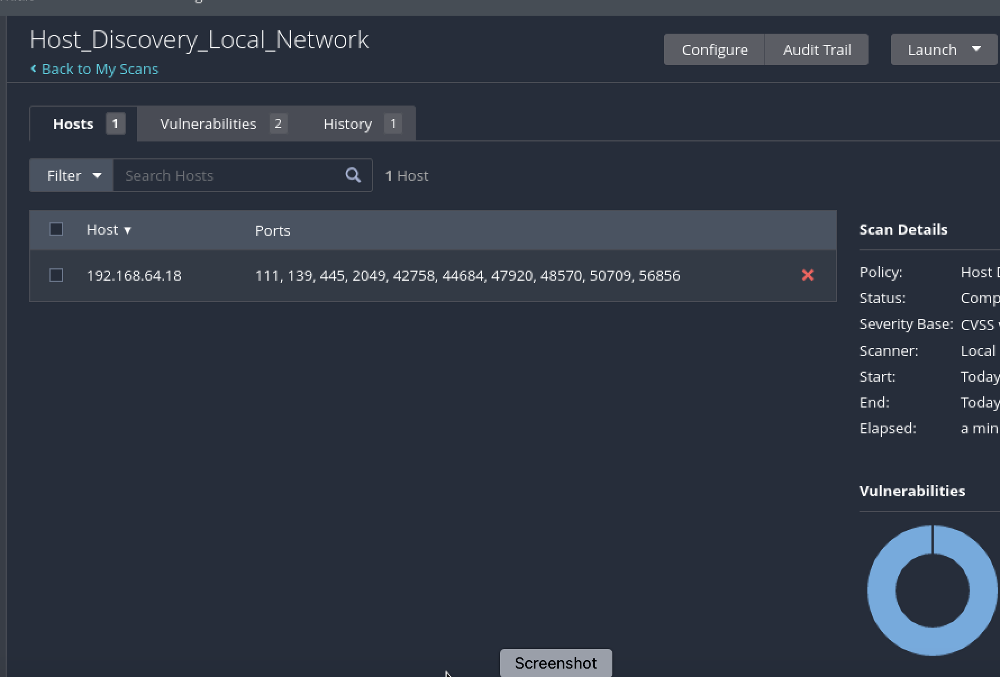
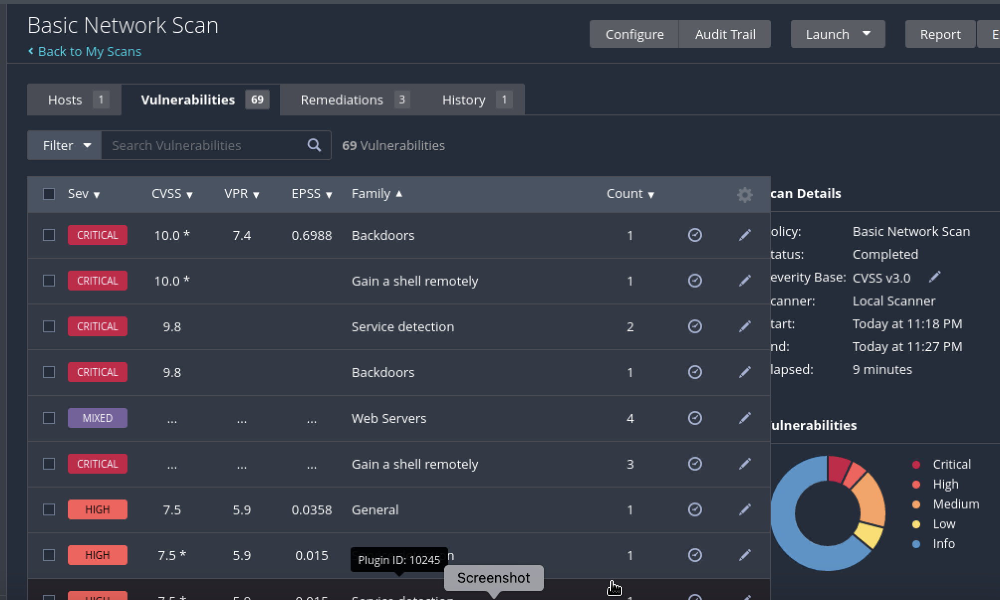

## Network Analysis and Vulnerability Scanning

### Tools Extended  
- UTM: Hypervisor for lab network virtualization  
- Kali Linux: Attacker system for offensive security tasks  
- Metasploitable2: Vulnerable virtual machine for exploitation practice  
- traceroute: Network route analysis tool for hop tracing  
- ping: ICMP utility for connectivity validation  
- ip / route: Network configuration and routing inspection commands  
- Wireshark: Traffic sniffer for protocol-level packet capture  
- Nessus Essentials: Vulnerability scanner for host discovery and auditing

---

## Traceroute and Wireshark Network Diagnostics

**Security Overview**
- Two virtual machines (Kali and Metasploitable2) deployed on a shared NAT network  
- End-to-end connectivity validated via ICMP and traceroute  
- Network troubleshooting using route analysis and adapter verification  
- Traffic capture and analysis via Wireshark  

**Implementation Summary**

1. UTM Network Configuration

2. Connectivity Validation 

3. Troubleshooting Procedures  

4. Wireshark Traffic Capture

5. Apply Filters

6. Packet Inspection

7. Statistics Summary

---

## Nessus Vulnerability Scanning

**Security Overview**
- Target machine scanned for active services and known vulnerabilities  
- Host Discovery followed by in-depth Basic Network Scan  
- Results highlight critical issues including remote backdoors and deprecated SSL/TLS protocols  

**Implementation Summary**
1. Nessus Service Initialization

2. Host Discovery Scan

3. Basic Network Scan

---

## Notes  
- All testing performed in an isolated lab environment
